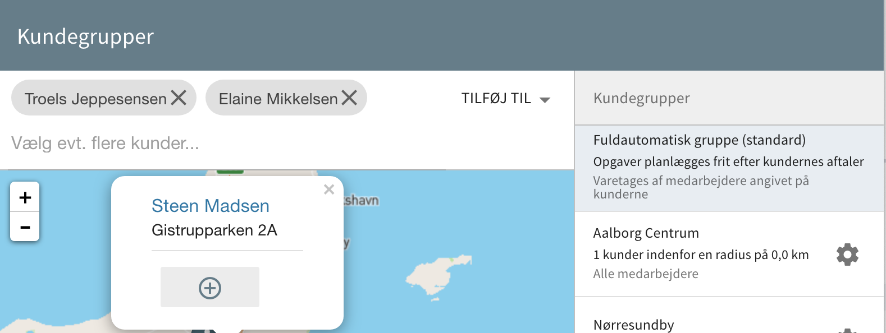

# Kundegrupper

I Previsto kan du oprette kundegrupper til organisering af dine kunder. Ved at inddele dine kunder i grupper kan du hjælpe Previsto til at følge den planlægning du foretrækker.

### Kunder uden gruppe \(Fuldautomatisk\) 

Som udgangspunkt vil alle kunder være i en standard gruppe som planlægger dine kunder helt automatisk ud fra afstande, intervaller m.m. Det kan for mange af dine kunder være helt fint og du kan derfor blot lade de kunder du ønsker fortsætte med at være i denne gruppe. De vil dog altid planlægges nøje i forhold til deres interval.

**Eksempel**

Hvis du har nogle kunder i samme område der skal besøges hver 4 uge, men du venter med at tage den ene kunde ugen efter du har taget de andre, så vil de også bliver planlagt i hver sin uge næste gang. Det vil de for at lave op til intervallet på aftalen - hver 4. uge.

Men du kan også have kunder du gerne vil have bliver planlagt sammen selvom du engang imellem måske tager dem lidt forskudt. Til det formål kan du oprette seperate kundegrupper.

### Kundegrupper 

Med en kundegruppe kan du angive overfor Previsto en gruppe af kunder du ønsker skal planlægges sammen. Det kan hjælpe dine kunder til at falde tilbage i samme interval selvom du har taget dem lidt forskudt.

Du kan tilføje kunder fra den fuldautomatiske gruppe til en ny eller eksisterende kundegruppe. Du klikker blot på den specifikke kunde på kortet og trykker på **`+`**. Kunden bliver tilføjet listen i toppen. Når du har valgt de kunder du vil flytte til en ny eller eksisterende kundegruppe klikker du på `Tilføj til`.

**Eksempel**

Hvis du har nogle kunder der skal besøges hver 4 uge, og du venter med at tage den ene kunde ugen efter du har taget de andre, så vil kundegruppen sørge for at de falder tilbage i samme interval. Hvis du tager en kunde forskudt i forhold til de andre kunder, så vil Previsto i højere grad forkorte eller forlænge intervallet til næste planlægning for igen at kunne planlægge kunden sammen med andre kunder i samme kundegruppe.

