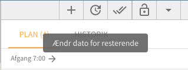

# Redigér arbejdsplan

Selvom Previsto intelligent planlægger dine arbejdsplaner, kan der være scenarier som Previsto ikke har kendskab til. Det kan være dårligt vejr, en kunde der ekstraordinært ikke skal have udført arbejde eller andet. I de tilfælde er der behov for at du manuelt kan lave rettelser til arbejdsplanen.

Se hvordan du redigerer dine arbejdsplaner manuelt i følgende video. Detaljer fortsætter på denne side efter videoen.



### Udskyd

Du kan udskyde arbejde en periode efter behov – enten for den enkelte kunde eller for alle kunder på ruten du endnu ikke har behandlet.

#### Udskyd en enkelt kunde

Klik på kunde på kortet og vælg derefter udskyd. En dialog vil åbne og give dig mulighed for at angive hvor meget aftalen skal udskydes.

#### Udskyd hele arbejdsplanen for en medarbejder

I højre side over listen af kunder på arbejdsplanen kan du vælge udskyd for alle de kunder der endnu ikke er blevet behandlet.

