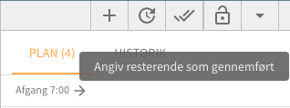

# Påbegynd og udfør opgave

Når du er i gang med din arbejdsdag er det godt at holde styr på hvor langt du er kommet efterhånden som dagen skrider frem. Det giver Previsto dig mulighed for direkte i planen.

### Påbegynd opgave

**Dette trin er valgfrit.** Når du vælger `Påbegynd` bliver opgaven markeret til at være igang og starttidspunkt bliver sat til nuværende tidspunkt. Herefter vil du løbende kunne se hvor mange minutter du har været i gang med opgaven og den forløbne tid vil blive taget i betragtning når du efterfølgende gennemfører opgaven.

Bemærk at det ikke er nødvendigt at vælge Påbegynd for at markere en opgave som gennemført. Men når du gør det, giver det dig et mere præcist billede af hvor lang tid du har brugt på et givent stykke arbejde.

### Markér opgave udført 

Du kan vælge at markere en enkelt opgave som gennemført eller hele ruten. Ofte vil en medarbejder markere opgaven som udført via sin smartphone efterhånden som dagen forløber og du vil kunne se hvad der er udført og hvad der er sprunget over.

#### En enkelt opgave

Ved at klikke på den enkelte opgave på kortet kan du markere opgaven som udført og det vil straks efter fremgå af kortet.

#### Alle opgaver på arbejdsplanen

I højre side over listen af kunder for dagen kan du markere alle opgaver på ruten som gennemført. Det medfører at alle opgaver du endnu ikke har behandlet på ruten vil blive markeret som gennemført på én gang og det vil straks efter fremgå af kortet.

