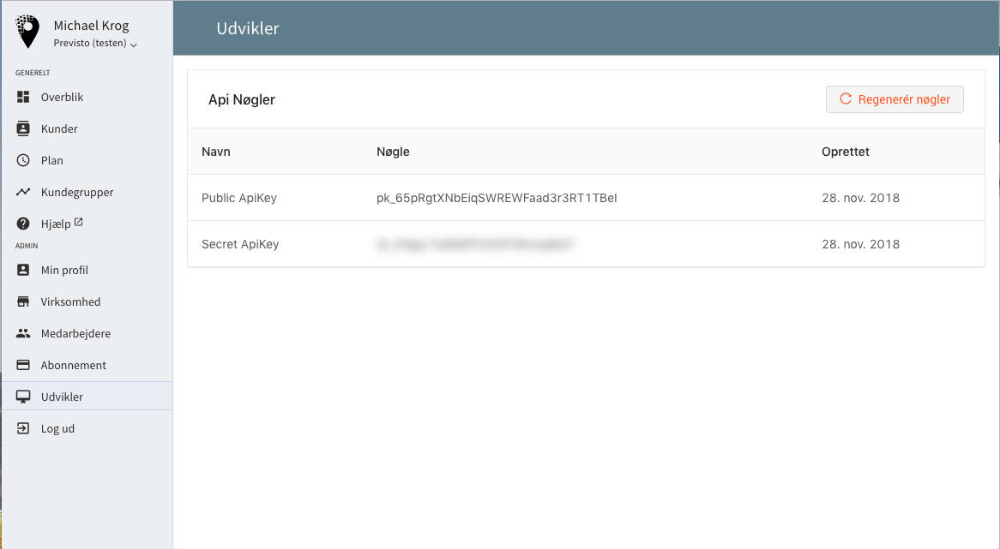

# Api Keys


This page is being built!


Previsto authenticates your API requests using your account’s API keys. If you do not include your key when making an API request, or use one that is incorrect or outdated, Stripe returns an error.

There are 2 types of API keys: _public_ and _secret_.

* **Public** API keys are not secret. In other words, they can safely be used in public places like your website. Public keys only have limited and cannot read data from your account. It can create contacts and agreements - and that's about it.
* **Secret** API keys are secret and should only be stored on your own servers. Your account’s secret API key can perform any API request to Previsto without any restrictions.

### How to obtain your API Keys

Your API keys are always available in Previsto under the menu item `Udvikler` \(Developer\). 


**Notice!**

It is **important** that you only use **Public ApiKey** when integrating from a public place, like your website.


