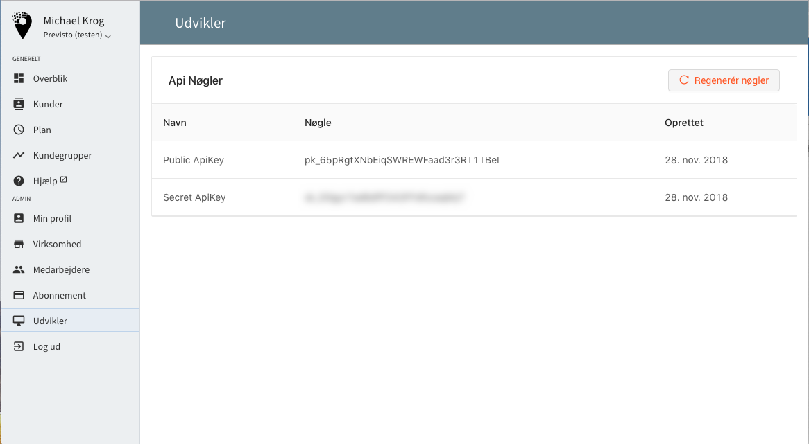

# Previsto.js og Elements


Denne side er under opbygning!



Denne sektion er af teknisk art og kræver at man selv har en basal viden om webudvikling \(HTML/Javascript\)


Previsto.js er vores Javascript-bibliotek til at bygge integrationer til Previsto fra andre hjemmesider. Det har primært fokus på offentlige hjemmesider og udstiller kun den begrænsede funktionalitet der er tilgængeligt herfra. Den primære tilgang med Previsto.js er Elements, som hjælper dig til at lave en integration ud fra nogle UI elementer du kan tilpasse til dit site.

Med Previsto.js kan du oprette nye kontakter og aftaler samt lave[ geokodning](https://en.wikipedia.org/wiki/Geocoding) af dine kunders adresser. Sikkerheden er automatisk håndteret - du skal stort set bare tilpasse det designet på din hjemmeside.

### Previsto Elements

Før du påbegynder integration til Previsto direkte fra dit eget website, skal du have en `public apikey` til din virksomhed. Du finder den under menupunktet `Udvikler` i Previsto når du er logget ind i din virksomhed.


**Bemærk!**  
Det er vigtigt at du kun bruger **Public ApiKey** når du integrerer fra dit website. Denne nøgle har ekstremt begrænset rettigheder og er egnet til at blive anvendt på offentlige steder - som f.eks. på dit website. Din **Public ApiKey** kan nemlig ikke bruges til at hente oplysninger fra din virksomhed. Den kan udelukkende bruges til at oprette en bruger med tilhørende tilbud/aftale. 


### 

