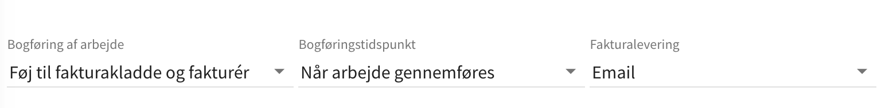

# Automatisk fakturering

Når du integrerer Previsto med et eksternt regnskabssystemet opnår du det bedste af 2 verdener:

* Et planlægningssystem med fokus på udførelse af dit arbejde
* Et regnskabssystem med fokus på din økonomi.

Når din virksomhed i Previsto er koblet op på et økonomisystem vil kunder automatisk blive synkroniseret og fakturaer kan automatisk blive oprettet og sendt til kunden når arbejde udføres.

### Indstillinger

Det er muligt at tilpasse indstillinger hvornår fakturering skal foregå, om Previsto skal bogføre fakturaen eller blot lade den være en kladde hvor løbende arbejde for en kunde kan opsamles og om den skal sendes til kunde på email eller ej. Indstillingenre kan foretages for alle kunder i virksomheden samt for den enkelte kunde.

#### Faktureringsindstillinger

Når du indstiller et regnskabssystem i Previsto får du nogle mulighed for hvordan faktureringen skal foregå som vist i følgende billede. Bemærk at alle 3 indstillinger også kan angives specifikt på den enkelte kunde, for at tilpasse behov for enkelte kunde. 



Du kan med her vælge:

1. Ingen bogføring – Der vil ikke blive oprette nogen fakturaer\)
2. Føj til fakturakladde – Der vil blive oprettet fakturakladder, men de bliver ikke bogført. Dette bruges ofte til kunder hvor der løbende igennem en periode samles op på samme faktura for senere at blive bogført manuelt igenne regnskabsprogrammet.
3. Føj til fakturakladde og fakturér \(Der bliver oprettet fakturakladder som bogføres med det samme\)



Bogføringstidspunktet giver dig mulighed for at styre hvornår Previsto skal oprette fakturaer for arbejdet. Som udgangspunkt er det indstillet til _Når arbejdet gennemføres_, men det kan også indstilles til _Før arbejdet gennemføres_. I det tilfælde vil fakturaer blive dannet natten til den arbejdsdag arbejdet er planlagt. Dette er ofte brugt i de tilfælde hvor fakturaer skal printes ud og bringes med ud til kunden.



### Systemer Previsto integrerer med

* [Dinero](integration-med-dinero.md) \(Danmark\)
* [Billy](integration-med-billy.md) \(Danmark\)
* [e-conomic](integration-med-e-conomic.md) \(Danmark\)

### Systemer Previsto senere vil integrere med

* Zipbooks
* Hiveage
* Wave Accounting
* Akaunting
* Debitoor \(Worldwide\)
* Fiken \(Norge\)

