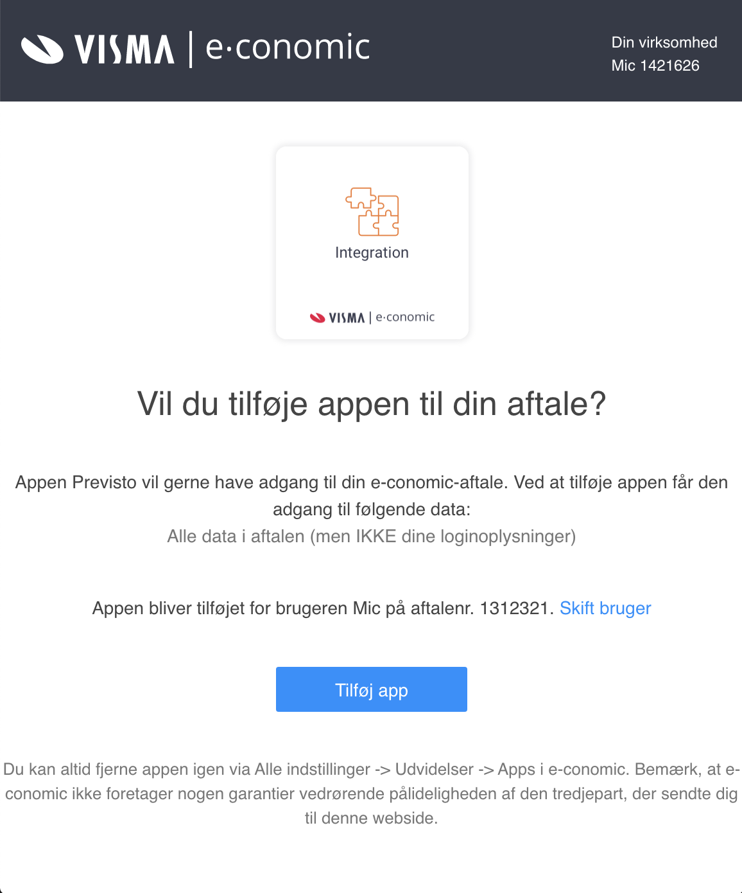
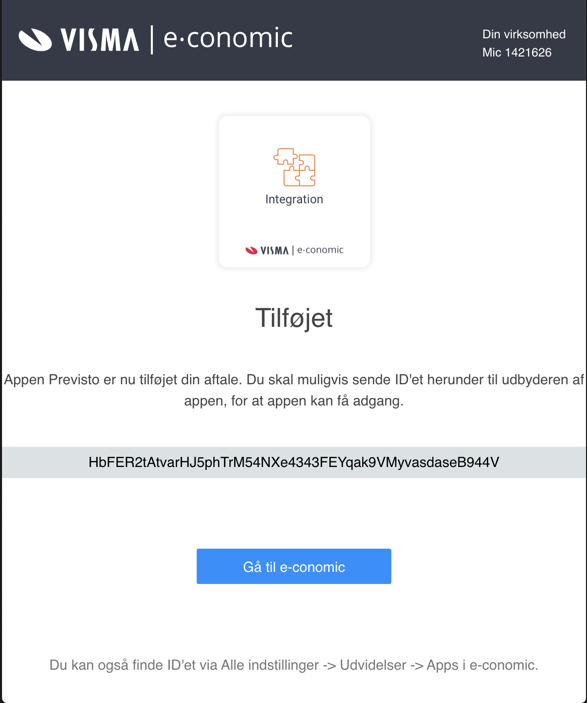

# Integration med e-conomic

Før du kan integrere med[ e-conomic](https://e-conomic.com) i Previsto skal du tilknytte Previsto til dit regnskab. Når du gør det vil du få en `agreementToken` fra e-conomic som giver adgang til at programmerne kan arbejde sammen uden at du skal gøre noget manuelt fremover.

Følg blot følgende steps for at koble Previsto sammen med e-conomic.

### 1. Knyt Previsto til dit regnskab

Det første du skal gøre er at knytte Previsto til dit regnskab. Det gør du ved at klikke på nedenstående link: 

[https://secure.e-conomic.com/secure/api1/requestaccess.aspx?appPublicToken=lZQNcnlmtGDfBFVbfS2SjWCxQod2523ofFXPSy4B3qc1](https://secure.e-conomic.com/secure/api1/requestaccess.aspx?appPublicToken=lZQNcnlmtGDfBFVbfS2SjWCxQod2523ofFXPSy4B3qc1&redirectUrl=http%3A%2F%2Fapp.previsto.com)

Du vil evt. blive bedt om at logge ind i dit regnskab i e-conomic og herefter spurgt om du vil tilføje Previsto til dit regnskab.

### 2. Kopiér kode

Når du har valgt at tilføje app'en til dit regskab vil du få vist en kode som vist i nedenstående billede. Koden skal du markere og kopiere \(CTRL+C el. CMD+C\).

Denne kode skal du bruge for at knytte Previsto til e-conomic.

### 3. Indsæt koden i Previsto

I Previsto vælger du Virksomhed i menuen og vælger indstillinger. Herunder kan du angive e-conomic som regnskabsprogram og angive koden du lige har kopieret.

Gem ændringerne og herefter vil Previsto automatisk hente kunder fra dit regnskab, oprette nye kunder og fakturaer i regnskabet efterhånden som du markerer arbejde udført og sender fakturaerne på mail til dine kunder.

