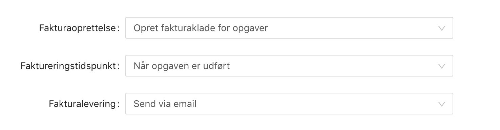

# Grundlæggende om fakturering

De fleste virksomheder der beskæftiger sig i servicebranchen har behov for at fakturere deres kunder direkte. Previsto giver dig mulighed for det ved at integrere med eksterne regnskabssystemer, herunder bl.a. Dinero, Billy og e-conomic.

Når Previsto er koblet op til et regnskabssystem vil dine kunder automatisk blive synkroniseret og dit arbejde faktureret og bogført.


**Bemærk følgende** 

* Efter tilkobling af regnskabssystemet kan efterfølgende ændringer af kunder i regnskabssystemet være op til 4 timer om at blive reflekteret i Previsto. 
* Ændringer til kunder i Previsto vil normalt blive reflekteret i regnsakbssystemet med det samme. 
* Nyoprettede kunder i Previsto bliver første oprettet i regnskabet ved første fakturering.


### Indstillinger

Det er muligt at tilpasse indstillinger hvornår fakturering skal foregå, om Previsto skal bogføre fakturaen eller blot lade den være en kladde hvor løbende arbejde for en kunde kan opsamles og om den skal sendes til kunde på email eller ej. Indstillingenre kan foretages for alle kunder i virksomheden samt for den enkelte kunde.

Når du indstiller et regnskabssystem i Previsto får du nogle mulighed for hvordan faktureringen skal foregå som vist i følgende billede. Bemærk at alle 3 indstillinger også kan angives specifikt på den enkelte kunde, for at tilpasse behov for enkelte kunde. 

#### Fakturaoprettelse

Under Fakturaoprettelse kan du vælge følgende:

1. `Ingen` – Der vil ikke blive oprette nogen fakturaer.
2. `Opret fakturaklade` – Der vil blive oprettet fakturaklader, men de bliver ikke bogført. Dette bruges ofte til kunder hvor der løbende igennem en periode samles op på samme faktura for senere at blive bogført manuelt igenne regnskabsprogrammet. 
3. `Opret bogført faktura for opgaver` – Der bliver oprettet fakturakladder som bogføres med det samme.

#### Faktureringstidspunkt

Faktureringstidspunktet giver dig mulighed for at styre hvornår Previsto skal oprette fakturaer for arbejdet. Som udgangspunkt er det indstillet til Når arbejdet gennemføres, men det kan også indstilles til Før arbejdet gennemføres. I det tilfælde vil fakturaer blive dannet natten til den arbejdsdag arbejdet er planlagt. Dette er ofte brugt i de tilfælde hvor fakturaer skal printes ud og bringes med ud til kunden.

#### Fakturalevering

Du kan vælge hvordan fakturaen skal leveres. Du kan fx. vælge at den skal leveres til kunde på email eller at den slet ikke skal leveres.

**Bemærk:** Det er pt. ikke muligt at sende EAN fakturaer fra Previsto. Dette skal gøres i regnskabssystemet. Du kan på den specifikke kunde sætte fakturalevering til `Ingen levering`. Når fakturaen er oprettet i regnskabssystemet kan du derfra sende fakturaen via EAN såfremt regnskabssystemet understøtter det.

### Understøttede systemer 

#### Anbefalede integrationer

Følgende integrationer understøtter alle dele af Previsto's kommunikation med regnskabssystemet.

* [Dinero](integration-med-dinero.md) \(Danmark\)
* [Billy](integration-med-billy.md) \(Danmark\)

#### Almindelig integrationer 

Enkelte dele af intregrationen til regnskabet kan ikke supporteres af følgende systemer. Følg link til den pågældende integration for at se detaljer.

* [e-conomic](integration-med-e-conomic.md) \(Danmark\)

### Kommende integrationer

* Zipbooks
* Hiveage
* Wave Accounting
* Debitoor \(Worldwide\)
* Fiken \(Norge\)

