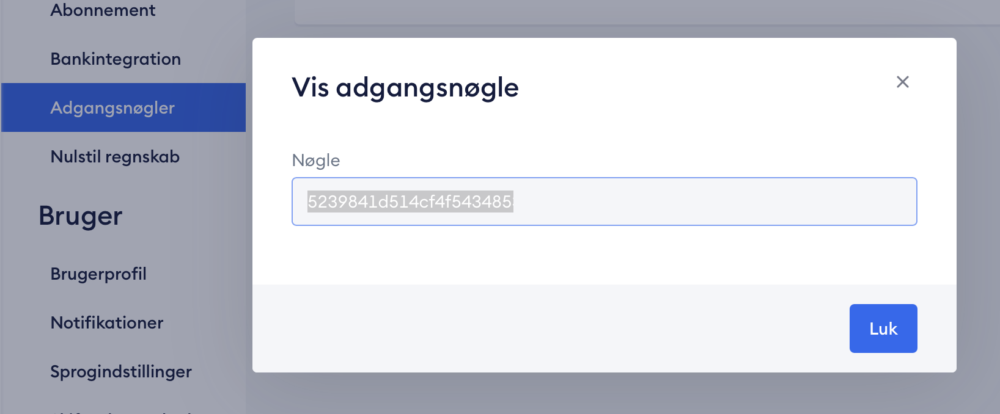
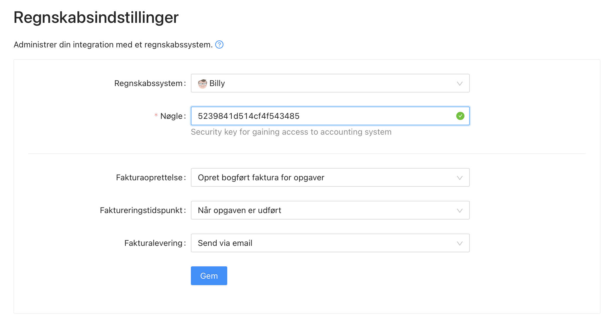

# Integration med Billy

Før du kan integrere med [Billy](https://previsto.com/da/partner/billy/) i Previsto skal du oprette en adgangsnøgle i dit regnskab. En adgangsnøgle giver adgang til at programmerne kan arbejde sammen uden at du skal gøre noget manuelt fremover.

### Opret adgangsnøgle i Billy 

Start med at logge ind på [Billy](https://previsto.com/da/partner/billy/). Under “Indstillinger” finder du “adgangsnøgler”. Opret nøglen og giv den et navn f.eks `Previsto`. Kopier nøglen til din udklipsholder.

### Indstil regnskabssystem i Previsto 

Adgangsnøglen skal nu indtastes i Previsto. Vælg “Virksomhed” i fanen til venstre, herefter menuen “Indstillinger”. Vælg Billy i listen over regnskabssystemer.

Indsæt din adgangnøgle, og klik derefter på fluebenet øverst til højre. Previsto og Billy er nu klar til brug.

