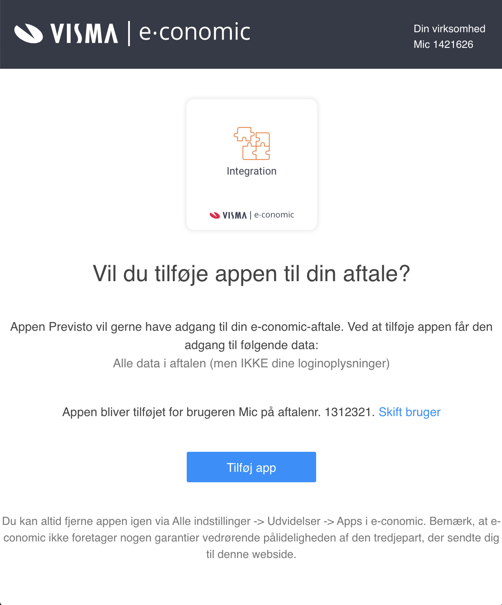
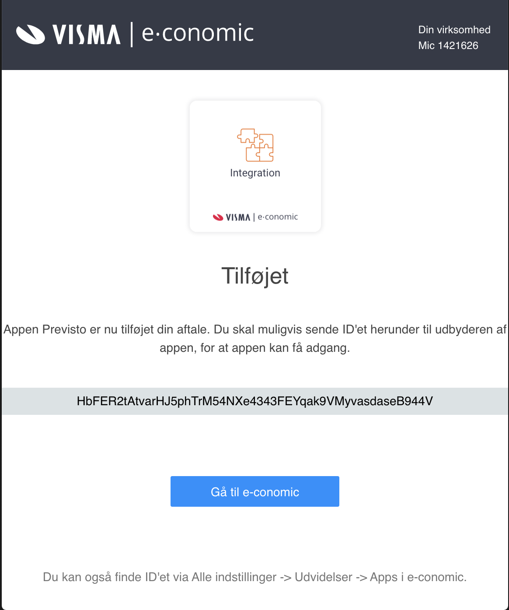
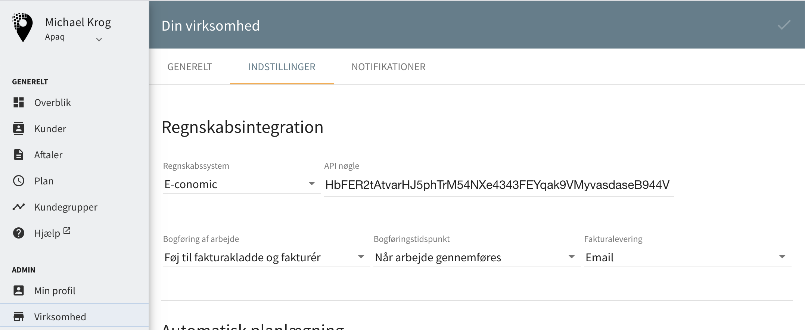
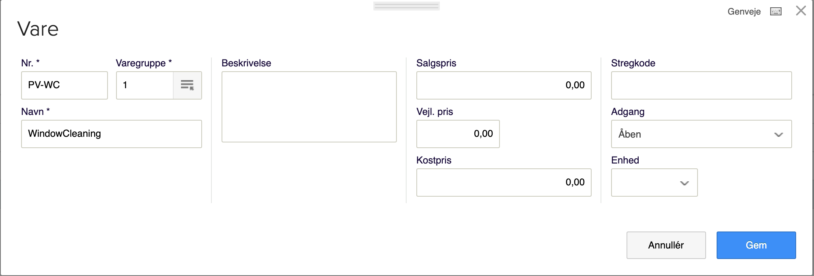
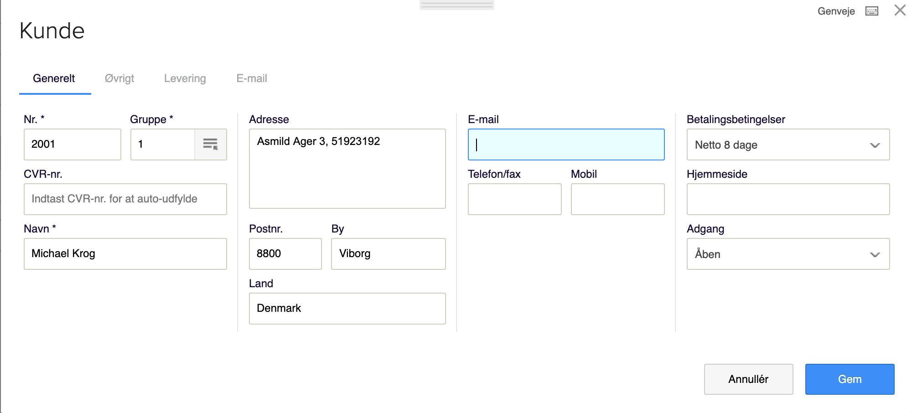

# Integration med e-conomic


**Bemærk:** Læs venligst de vigtige oplysninger vedr. integration til E-conomic nederst på denne side. I forhold til andre regnskabsysstemer har E-conomic diverse tekniske begrænsninger, som gør at integrationen til E-conomic har nogle funktionelle mangler.


Før du kan integrere med[ e-conomic](https://e-conomic.com) i [Previsto](https://previsto.com) skal du tilknytte Previsto til dit regnskab. Når du gør det vil du få **en kode** fra e-conomic som giver adgang til at programmerne kan arbejde sammen uden at du skal gøre noget manuelt fremover.

Følg blot følgende steps for at koble Previsto sammen med e-conomic.

### 1. Knyt Previsto til dit regnskab

Det første du skal gøre er at knytte Previsto til dit regnskab. Det gør du ved at klikke på nedenstående link: 

[https://secure.e-conomic.com/secure/api1/requestaccess.aspx?appPublicToken=lZQNcnlmtGDfBFVbfS2SjWCxQod2523ofFXPSy4B3qc1](https://secure.e-conomic.com/secure/api1/requestaccess.aspx?appPublicToken=lZQNcnlmtGDfBFVbfS2SjWCxQod2523ofFXPSy4B3qc1)

Du vil evt. blive bedt om at logge ind i dit regnskab i e-conomic og herefter spurgt om du vil tilføje Previsto til dit regnskab.

### 2. Kopiér kode

Når du har valgt at tilføje app'en til dit regskab vil du få vist en kode som vist i nedenstående billede. Koden skal du markere og kopiere \(CTRL+C el. CMD+C\).

Denne kode skal du bruge for at knytte Previsto til e-conomic.

### 3. Indsæt koden i Previsto

I Previsto vælger du Virksomhed i menuen og vælger indstillinger. Herunder kan du angive e-conomic som regnskabsprogram og angive koden du lige har kopieret.

Gem ændringerne og herefter vil Previsto automatisk hente kunder fra dit regnskab, oprette nye kunder og bogføre fakturaer i regnskabet efterhånden som du markerer arbejde udført og sender fakturaerne på mail til dine kunder.

### **Vigtige oplysninger**

Følgende er nogle vigtige oplysninger om vores integration til e-conomic. Læs dem venligst grundigt i forbindelse med opsætning af integration til e-conomic.

#### **Vare og varegruppe** 

Previsto opretter en ny vare med koden `PV-WC` i dit regnskab når du tilknytter Previsto. Denne vare bruges hver gang arbejde faktureres. Det er dog ikke muligt for Previsto at hente oplysninger om hvilken varegruppe der som udgangspunkt skal bruges når Previsto opretter vare. Previsto bruger derfor den første varegruppe den kan finde den kan finde.

#### Kunder og kundegrupper

Ligeledes oprette Previsto kunder i dit regnskab, hvis de kunder der bliver faktureret endnu ikke eksisterer i dit regnskab. Det er dog ikke heller muligt for Previsto at hente oplysninger om hvilken kundegruppe der som udgangspunkt skal bruges. Previsto bruger derfor også den første kundegruppe den kan finde som vist på i nedenstående billede.

Bemærk også at E-conomic ikke understøtter at kundenumre ændres efter kunden er oprettet. Hvis der ved oprettelse af en kunde i Previsto ikke angives et kundenummer, vil E-conomic autogenerere et kundenummer. 

#### **Afsendelse af faktura via email**

Ved afsendelse af fakturaer via email fra Previsto, håndteres dette udelukkende af Previsto. Det betyder følgende:

* Email'en har et andet udseende end hvis den var sendt fra e-conomic.
* Email'en er sendt fra Previsto's domæne \(previsto.com\), men med dit firmanavn som afsender.
* Afsendelsen af email'en bliver ikke registreret i e-conomic.

Årsagen til at vi håndterer afsendelsen af email i vores e-conomic integration skyldes at e-conomic ikke understøtter afsendelse af fakturaer via deres API.

> Sending sales documents via email is not supported through API. To send an order or invoice via email, you must fetch the necessary data/PDF via the API and email either the file or a link to a self-hosted endpoint via own email solution. – e-conomic

 

