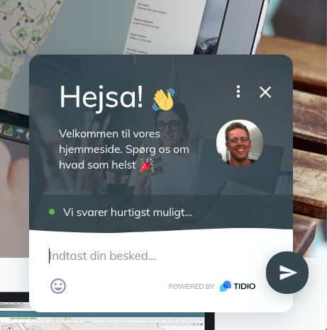

# Kontakt med Previsto's Support

### Muligheder for support

* 24/5 live chat direkte i Previsto's brugerflade og på vores hjemmeside [https://previsto.com](https://previsto.com) — vi svarer så hurtigt vi kan!
* Email support på support@previsto.com \(svar indenfor 2 arbejdsdage\)

### Hvorfor er der ingen telefonsupport? 

Vi tror på at det ikke ville være muligt at yde den samme effektive hjælp via telefonen. Live chat er altid ét klik væk i din Previsto-brugerflade uden at du behøver søge efter et telefonnummer, ringe op og vente på at kunne komme i kontakt med dn rigtige person. Live chat er enklere, hurtigere og afbryder ikke din daglige rutine! Lad os anføre et par flere grunde til vores beslutning:

* Live chat giver os mulighed for at yde hurtig support - for at starte en samtale, skal du bare skrive til os. **Du er ikke sat på hold i en telefonkø** og venter på at blive tilsluttet! Under selve samtalen er vi i stand til øjeblikkeligt at se din Previsto-konto og dine indstillinger. Takket være alt dette kan vi fejlfinde på ganske kort tid. 
* Vi kan **nemt udveksle filer og dokumenter**! Du kan let sende os skærmbilleder eller links for bedre at kunne se det problem du sidder med. Vi kan også sende dig skærmbilleder for at guide dig gennem opsætning eller andet. 
* At opretholde et callcenter koster mange penge! At reducere disse udgifter giver os mulighed for at fokusere på at levere et billigere produkt. 
* Hver samtale bliver gemt så alle i support-teamet er opdaterede med samtalen. Du kan vende tilbage til samtalen når som helst i fremtiden. Selv hvis du ikke kommer i kontakt med den samme supporter, behøver du ikke at gentage det du allerede har skrevet til os!

